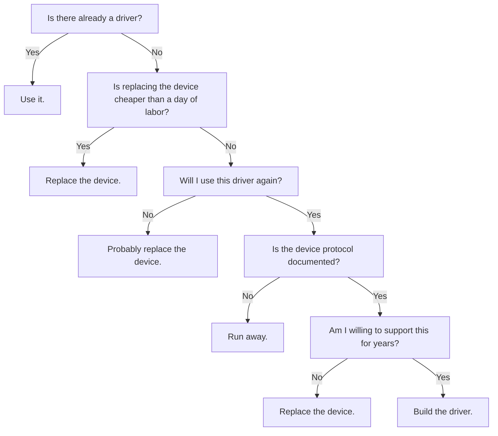

## Should I Make a Custom Driver?

```mermaid
flowchart TD
    A["Is there already a driver?"] -->|Yes| A1["Use it."]
    A -->|No| B["Is replacing the device cheaper than a day of labor?"]
    B -->|Yes| B1["Replace the device."]
    B -->|No| C["Will I use this driver again?"]
    C -->|No| C1["Probably replace the device."]
    C -->|Yes| D["Is the device protocol documented?"]
    D -->|No| D1["Run away."]
    D -->|Yes| E["Am I willing to support this for years?"]
    E -->|No| E1["Replace the device."]
    E -->|Yes| E2["Build the driver."]
```